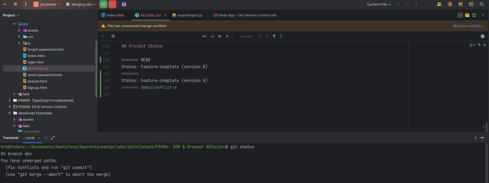
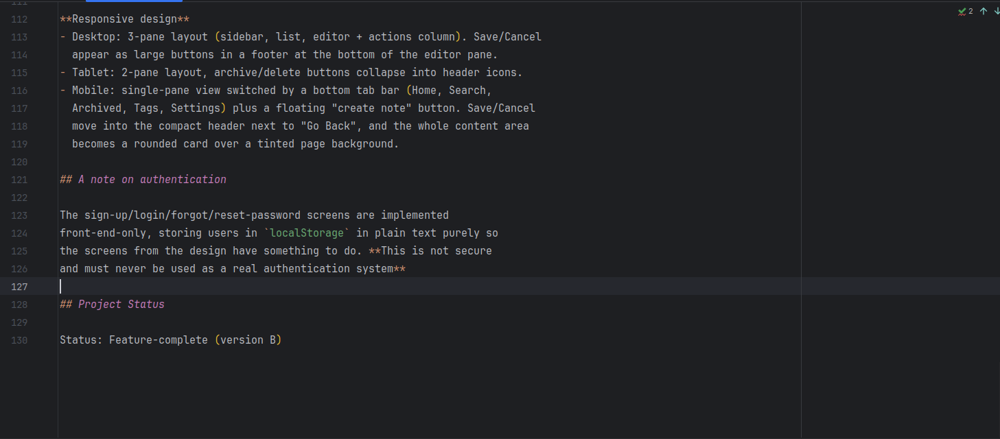
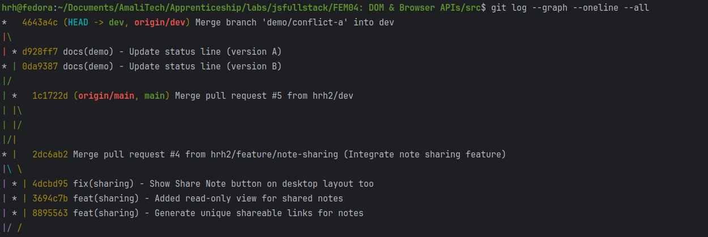
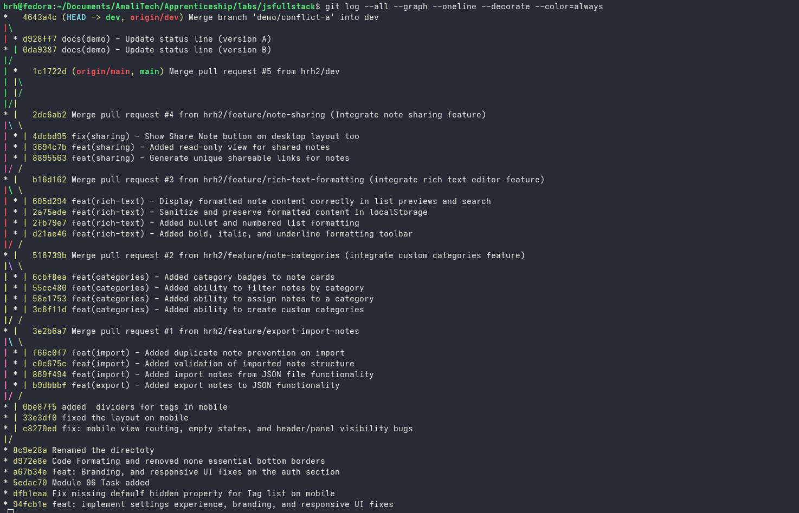
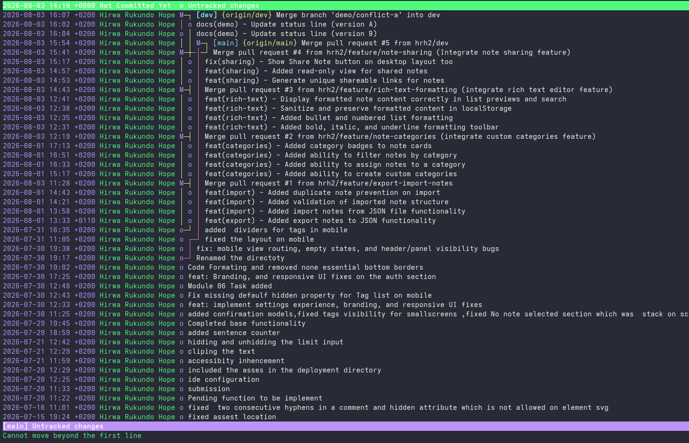
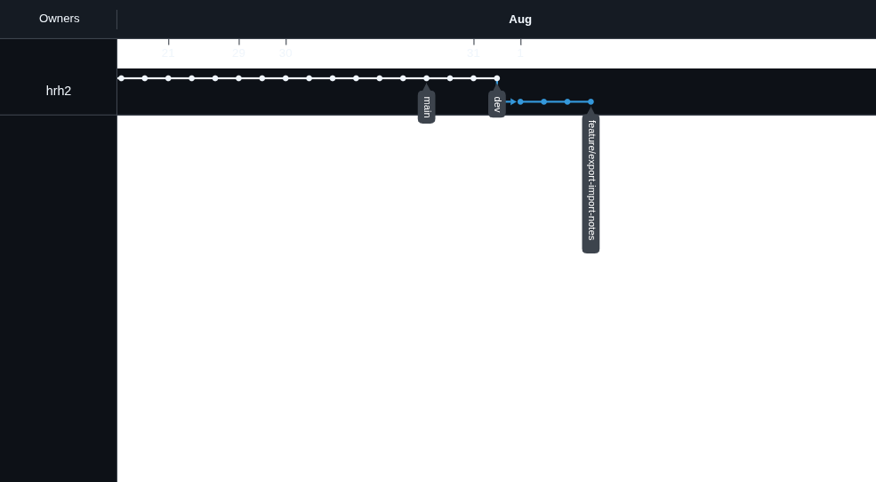
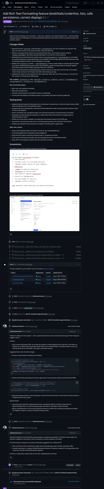

# Git Workflow — Note-Taking Web App

This document describes the branching strategy, commit conventions, and Git
practices used while building the Note-Taking Web App for this lab.

## Branching Strategy

This project uses a three-branch workflow:

- **`main`** — always stable, deployable code. Only updated by merging `dev`
  in once a batch of features has been reviewed and tested.
- **`dev`** — the integration branch. All feature branches are created from
  `dev` and merged back into `dev` via pull request after TA review.
- **`feature/*`** — one branch per feature, created from `dev`, deleted
  (locally and remotely) once merged.

```
main
 └── dev
      ├── feature/export-import-notes
      ├── feature/note-categories
      ├── feature/rich-text-formatting
      └── feature/note-sharing
```

### Workflow per feature

1. `git checkout dev && git pull origin dev`
2. `git checkout -b feature/<name>`
3. Make focused commits, one requirement at a time (3+ commits per feature)
4. `git push origin feature/<name>`
5. Open a pull request: `feature/<name>` → `dev`
6. Assign to TA for review; address any feedback with follow-up commits
7. TA approves → merge the PR
8. `git checkout dev && git pull origin dev`
9. Delete the feature branch, locally and remotely:
   ```bash
   git branch -d feature/<name>
   git push origin --delete feature/<name>
   ```

Once all features for a milestone are merged into `dev` and tested together,
`dev` is merged into `main` via its own pull request to release the changes.

## Commit Conventions

Commits follow a `type(scope) - description` format:

```
feat(export) - Added export notes to JSON functionality
feat(import) - Added import notes from JSON file functionality
feat(import) - Added validation of imported note structure
feat(import) - Added duplicate note prevention on import
feat(categories) - Added ability to create custom categories
feat(categories) - Added ability to assign notes to a category
feat(categories) - Added ability to filter notes by category
feat(categories) - Added category badges to note cards
feat(rich-text) - Added bold, italic, and underline formatting toolbar
feat(rich-text) - Added bullet and numbered list formatting
feat(rich-text) - Sanitize and preserve formatted content in localStorage
feat(rich-text) - Display formatted note content correctly in list previews and search
fix(rich-text) - Sanitize paste, draft save, and draft restore per TA review
feat(sharing) - Generate unique shareable links for notes
feat(sharing) - Added read-only view for shared notes
feat(sharing) - Added copy link to clipboard functionality
fix(sharing) - Show Share Note button on desktop layout too
```

**Types used:** `feat` (new functionality), `fix` (bug fix), `docs`
(documentation only).
**Scope:** the feature area the commit touches (`export`, `import`,
`categories`, `rich-text`, `sharing`).

## Merge Conflict & Resolution

To satisfy the requirement of documenting a real merge conflict, one was
deliberately created (rather than waiting for one to happen by chance) using
two short-lived demo branches off `dev`, both editing the same line of
`README.md`:

- `demo/conflict-a` set the status line to `Status: Feature-complete (version A)`
- `demo/conflict-b` set the same line to `Status: Feature-complete (version B)`

`demo/conflict-a` merged into `dev` cleanly. Merging `demo/conflict-b`
afterward produced a conflict on that same line:

```
<<<<<<< HEAD
Status: Feature-complete (version A)
=======
Status: Feature-complete (version B)
>>>>>>> demo/conflict-b
```

**Resolution:** opened `README.md`, removed the conflict markers, and kept a
single combined status line, then staged and completed the merge commit:

```bash
git add README.md
git commit
git push origin dev
```

Both demo branches were deleted afterward:

```bash
git branch -d demo/conflict-a
git branch -d demo/conflict-b
```

**Screenshots:**
- Screenshot: `git status` / file showing conflict markers

- Resolved file after editing

- `git log --graph --oneline --all` showing the merge commit


## Useful Git Commands

| Command | Purpose |
|---|---|
| `git checkout -b feature/<name>` | Create and switch to a new feature branch |
| `git status` | See staged/unstaged changes and current branch |
| `git add <file>` | Stage a file for commit |
| `git commit -m "type(scope) - description"` | Commit staged changes |
| `git push origin <branch>` | Push a branch to the remote |
| `git pull origin <branch>` | Update local branch from the remote |
| `git log --graph --oneline --all` | View commit history as a graph across all branches |
| `git branch -d <branch>` | Delete a local branch (only if merged) |
| `git branch -D <branch>` | Force-delete a local branch |
| `git push origin --delete <branch>` | Delete a branch on the remote |
| `git merge <branch>` | Merge another branch into the current branch |
| `git diff` | Show unstaged changes |

## Screenshots

- `git log --graph --oneline --all` — Commit history across `main`/`dev`/feature branches

- Or

- GitHub Network graph showing branch structure

- An example merged pull request, e.g. Note Categories/Folders

